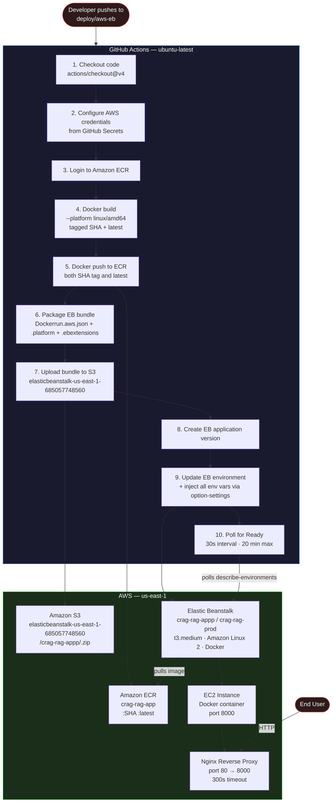
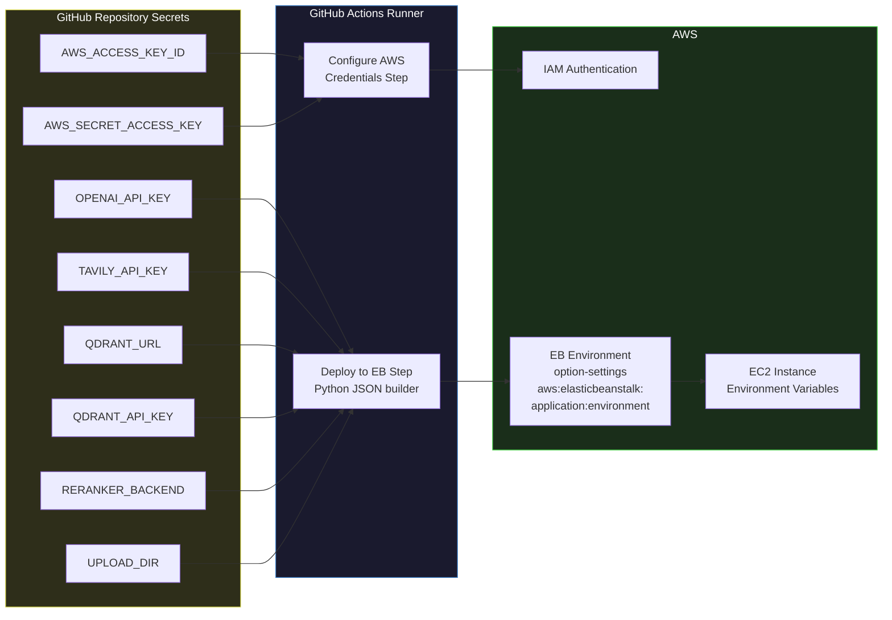
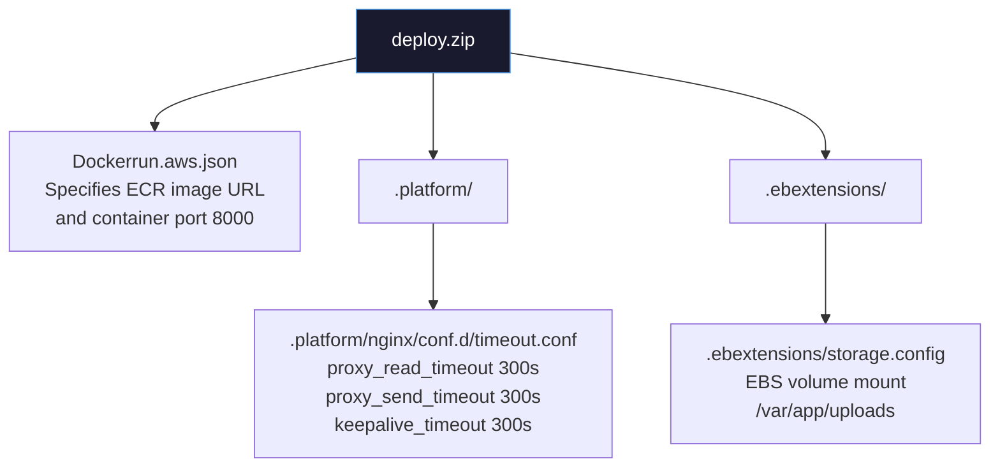
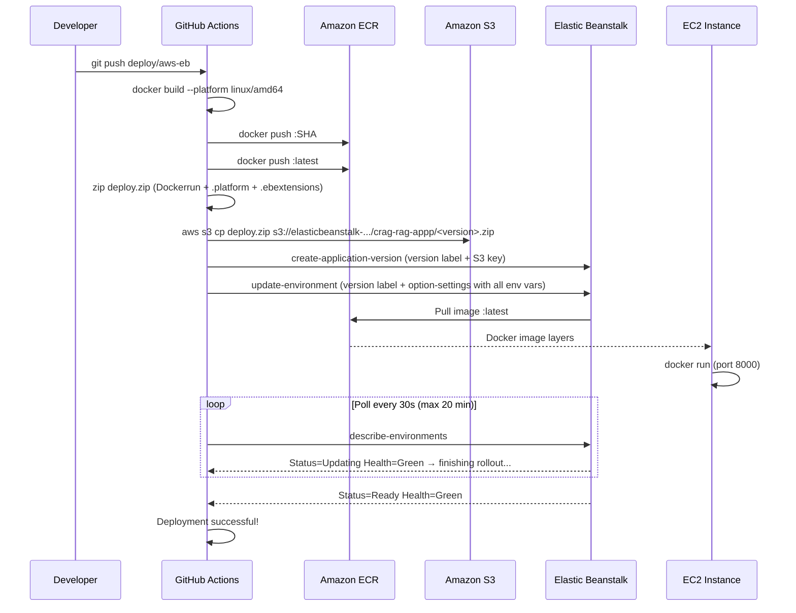

# AWS Deployment Architecture

## CI/CD Pipeline Flow

```mermaid
flowchart TD
    DEV([Developer pushes to\ndeploy/aws-eb]) --> GHA

    subgraph GHA["GitHub Actions — ubuntu-latest"]
        direction TB
        S1[1. Checkout code\nactions/checkout@v4]
        S2[2. Configure AWS credentials\nfrom GitHub Secrets]
        S3[3. Login to Amazon ECR]
        S4[4. Docker build\n--platform linux/amd64\ntagged SHA + latest]
        S5[5. Docker push to ECR\nboth SHA tag and latest]
        S6[6. Package EB bundle\nDockerrun.aws.json + .platform + .ebextensions]
        S7[7. Upload bundle to S3\nelasticbeanstalk-us-east-1-685057748560]
        S8[8. Create EB application version]
        S9[9. Update EB environment\n+ inject all env vars via option-settings]
        S10[10. Poll for Ready\n30s interval · 20 min max]

        S1 --> S2 --> S3 --> S4 --> S5 --> S6 --> S7 --> S8 --> S9 --> S10
    end

    subgraph AWS["AWS — us-east-1"]
        ECR["Amazon ECR\ncrag-rag-app\n:SHA  :latest"]
        S3B["Amazon S3\nelasticbeanstalk-us-east-1-685057748560\n/crag-rag-appp/<version>.zip"]
        EB["Elastic Beanstalk\ncrag-rag-appp / crag-rag-prod\nt3.medium · Amazon Linux 2 · Docker"]
        EC2["EC2 Instance\nDocker container\nport 8000"]
        NGX["Nginx Reverse Proxy\nport 80 → 8000\n300s timeout"]
    end

    S5 --> ECR
    S7 --> S3B
    S9 --> EB
    EB -->|pulls image| ECR
    EB --> EC2
    EC2 --> NGX

    USER([End User]) -->|HTTP| NGX
    S10 -->|polls describe-environments| EB

    style GHA fill:#1a1a2e,stroke:#4a90d9,color:#fff
    style AWS fill:#1a2e1a,stroke:#4ad94a,color:#fff
    style DEV fill:#2e1a1a,stroke:#d94a4a,color:#fff
    style USER fill:#2e1a1a,stroke:#d94a4a,color:#fff
```

---

## GitHub Secrets Flow

```mermaid
flowchart LR
    subgraph SECRETS["GitHub Repository Secrets"]
        direction TB
        AK[AWS_ACCESS_KEY_ID]
        AS[AWS_SECRET_ACCESS_KEY]
        OA[OPENAI_API_KEY]
        TA[TAVILY_API_KEY]
        QU[QDRANT_URL]
        QK[QDRANT_API_KEY]
        RB[RERANKER_BACKEND]
        UD[UPLOAD_DIR]
    end

    subgraph GHA["GitHub Actions Runner"]
        CREDS[Configure AWS\nCredentials Step]
        EBSTEP[Deploy to EB Step\nPython JSON builder]
    end

    subgraph AWS["AWS"]
        IAM[IAM Authentication]
        EBENV[EB Environment\noption-settings\naws:elasticbeanstalk:\napplication:environment]
        EC2ENV[EC2 Instance\nEnvironment Variables]
    end

    AK & AS --> CREDS --> IAM
    OA & TA & QU & QK & RB & UD --> EBSTEP --> EBENV --> EC2ENV

    style SECRETS fill:#2e2e1a,stroke:#d9d94a,color:#fff
    style GHA fill:#1a1a2e,stroke:#4a90d9,color:#fff
    style AWS fill:#1a2e1a,stroke:#4ad94a,color:#fff
```

---

## EB Bundle Structure

```mermaid
flowchart TD
    ZIP["deploy.zip"]
    ZIP --> DRJ["Dockerrun.aws.json\nSpecifies ECR image URL\nand container port 8000"]
    ZIP --> PLT[".platform/"]
    PLT --> NGX[".platform/nginx/conf.d/timeout.conf\nproxy_read_timeout 300s\nproxy_send_timeout 300s\nkeepalive_timeout 300s"]
    ZIP --> EBX[".ebextensions/"]
    EBX --> STG[".ebextensions/storage.config\nEBS volume mount\n/var/app/uploads"]

    style ZIP fill:#1a1a2e,stroke:#4a90d9,color:#fff
```

---

## Deployment Sequence

```mermaid
sequenceDiagram
    participant DEV as Developer
    participant GH as GitHub Actions
    participant ECR as Amazon ECR
    participant S3 as Amazon S3
    participant EB as Elastic Beanstalk
    participant EC2 as EC2 Instance

    DEV->>GH: git push deploy/aws-eb

    GH->>GH: docker build --platform linux/amd64
    GH->>ECR: docker push :SHA
    GH->>ECR: docker push :latest

    GH->>GH: zip deploy.zip (Dockerrun + .platform + .ebextensions)
    GH->>S3: aws s3 cp deploy.zip s3://elasticbeanstalk-.../crag-rag-appp/<version>.zip

    GH->>EB: create-application-version (version label + S3 key)
    GH->>EB: update-environment (version label + option-settings with all env vars)

    EB->>ECR: Pull image :latest
    ECR-->>EC2: Docker image layers
    EC2->>EC2: docker run (port 8000)

    loop Poll every 30s (max 20 min)
        GH->>EB: describe-environments
        EB-->>GH: Status=Updating Health=Green → finishing rollout...
    end

    EB-->>GH: Status=Ready Health=Green
    GH->>GH: Deployment successful!
```

---

*Author: Sourangshu Pal*
