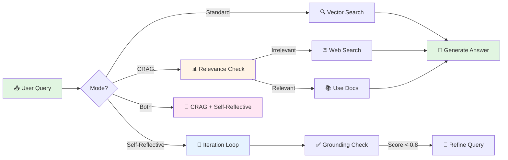

<div align="center">

# 🔮 Corrective + Self-Reflective RAG

### *Advanced Retrieval-Augmented Generation with Adaptive Intelligence*

[](https://www.python.org/downloads/)
[](https://fastapi.tiangolo.com)
[](https://qdrant.tech)
[](https://openai.com)
[](https://docs.astral.sh/uv/)
[](https://opensource.org/licenses/MIT)

<p align="center">
  <i>🎯 Hybrid Vector Search • 🔍 Relevance Evaluation • 🌐 Web Search Fallback • ✨ Answer Validation</i>
</p>

[Features](#-features) • [Quick Start](#-quick-start) • [Architecture](#-architecture) • [API](#-api-endpoints) • [Workflows](#-workflows)

<br>

```ascii
╔══════════════════════════════════════════════════════════════╗
║                                                              ║
║   📚 Upload Documents  →  🔍 Hybrid Search  →  🤖 LLM Gen    ║
║                                                              ║
║   ✅ Hybrid Search: Dense + Sparse + RRF Fusion             ║
║   ✅ CRAG: Adaptive Web Search Based on Relevance           ║
║   ✅ Self-Reflective: Iterative Answer Grounding            ║
║   ✅ Both: Combined for Maximum Quality                     ║
║                                                              ║
╚══════════════════════════════════════════════════════════════╝
```

</div>

---

## ✨ Features

<table>
<tr>
<td width="50%">

### 🎯 **CRAG Mode**
- 📊 **LLM-based relevance evaluation**
- 🌐 **Adaptive web search** (Tavily)
- 🔀 **Smart routing** (relevant/ambiguous/irrelevant)
- ⚡ **Real-time data access**

</td>
<td width="50%">

### 🔍 **Self-Reflective Mode**
- ✅ **Answer grounding validation**
- 🔄 **Iterative query refinement**
- 🎯 **Hallucination detection**
- 📝 **Source attribution**

</td>
</tr>
<tr>
<td width="50%">

### 🚀 **Both Mode**
- 🔮 **CRAG + Self-Reflective combined**
- 🏆 **Maximum quality assurance**
- 🌐 **Web search preserved across iterations**
- 🎓 **Production-ready accuracy**

</td>
<td width="50%">

### 🛠️ **Core Capabilities**
- 🔍 **Hybrid Search**: Dense + Sparse + RRF
- 📄 **Multi-format support** (PDF, MD, TXT, JSON)
- 🧩 **HybridChunker** (Docling integration)
- 🗄️ **Qdrant dual vector storage**
- 🔧 **Optional HYDE + Reranking**

</td>
</tr>
</table>

---

## 🔍 Hybrid Search Modes

This system implements **true hybrid search** using Qdrant's dual vector system:

| Mode | Description | Best For |
|------|-------------|----------|
| **🎯 Dense** | Semantic search using OpenAI embeddings | Conceptual queries, synonyms |
| **📝 Sparse** | BM25 keyword search with IDF weighting | Exact terms, technical jargon |
| **⚡ Hybrid** | RRF fusion of dense + sparse (default) | Best overall accuracy |

**Key Features:**
- **Dual Vector Indexing**: Every document gets both dense (1536-dim) and sparse (BM25) vectors
- **RRF Fusion**: Reciprocal Rank Fusion combines rankings from both search methods
- **Automatic Tokenization**: 50+ stop words filtered, term frequency analysis
- **Compatible**: Works with all RAG modes, HYDE, and reranking

---

## 🚀 Quick Start

### Prerequisites

```bash
✅ Python 3.12+
✅ Docker (for Qdrant)
✅ OpenAI API Key
✅ Tavily API Key (for CRAG mode)
```

### Installation in 3 Steps

```bash
# 1️⃣ Install uv (ultra-fast package manager)
curl -LsSf https://astral.sh/uv/install.sh | sh

# 2️⃣ Clone and setup
git clone <repo-url>
cd corrective_self_reflective_rag
cp .env.example .env
# Edit .env with your API keys

# 3️⃣ Start services
docker run -p 6333:6333 qdrant/qdrant  # Terminal 1
uv run uvicorn app.main:app --reload   # Terminal 2
```

🎉 **Done!** API running at http://localhost:8000 • Docs at http://localhost:8000/docs

---

## 🏗️ Architecture

<div align="center">



</div>

### 🎯 RAG Mode Comparison

| Feature | Standard | CRAG | Self-Reflective | Both |
|---------|----------|------|-----------------|------|
| **Hybrid Search** | ✅ | ✅ | ✅ | ✅ |
| **Web Search** | ❌ | ✅ | ❌ | ✅ |
| **Quality Validation** | ❌ | ❌ | ✅ | ✅ |
| **Query Refinement** | ❌ | ❌ | ✅ | ✅ |
| **Latency** | 🟢 Fast | 🟡 Medium | 🟠 Slow | 🔴 Slowest |
| **Accuracy** | 🟡 Good | 🟢 Better | 🟢 Better | 🟢 Best |
| **Use Case** | Simple Q&A | Current data | High accuracy | Production |

---

## 📡 API Endpoints

### 1️⃣ Upload Document

```bash
curl -X POST "http://localhost:8000/upload/" \
  -F "file=@document.pdf"
```

**Response:** ✅ Document processed → Chunks stored in Qdrant

### 2️⃣ Query (CRAG Mode)

```bash
curl -X POST "http://localhost:8000/query/" \
  -H "Content-Type: application/json" \
  -d '{
    "query": "What is the weather today in New Delhi?",
    "mode": "crag",
    "top_k": 5
  }'
```

**Returns:** Answer + Relevance Evaluation + Web Search Results (if triggered)

### 3️⃣ Query (Self-Reflective Mode)

```bash
curl -X POST "http://localhost:8000/query/" \
  -H "Content-Type: application/json" \
  -d '{
    "query": "Explain the methodology in detail",
    "mode": "self_reflective",
    "top_k": 5
  }'
```

**Returns:** Refined Answer + Reflection Score + Iteration Count

### 4️⃣ Query with Hybrid Search (Recommended)

```bash
curl -X POST "http://localhost:8000/query/" \
  -H "Content-Type: application/json" \
  -d '{
    "query": "What are the latest AI developments?",
    "mode": "both",
    "search_mode": "hybrid",
    "top_k": 5,
    "enable_hyde": true,
    "enable_reranking": true
  }'
```

**Returns:** Maximum quality answer with Hybrid Search + CRAG + Self-Reflective

**Search Mode Options:**
- `"dense"` - Semantic search only
- `"sparse"` - Keyword search only (BM25)
- `"hybrid"` - RRF fusion (default, recommended)

### 5️⃣ Compare All Modes

```bash
curl "http://localhost:8000/query/compare?query=Your%20question&top_k=5"
```

**Returns:** Side-by-side comparison of Standard, CRAG, and Self-Reflective

---

## 📊 Workflows

Detailed Mermaid diagrams available in [`workflows/`](./workflows/):

- 🏗️ **[Project Architecture](./workflows/project_architecture.md)** - Complete system design
- 🔄 **[CRAG Mode](./workflows/crag_mode.md)** - Adaptive web search workflow
- 🔍 **[Self-Reflective Mode](./workflows/self_reflective_mode.md)** - Grounding validation workflow
- 🚀 **[Both Mode](./workflows/both_mode.md)** - Combined pipeline workflow

---

## ⚙️ Configuration

Key settings in `.env`:

```bash
# 🤖 LLM Configuration
OPENAI_API_KEY=sk-...
LLM_MODEL=gpt-4o-mini

# 🔍 Hybrid Search Settings
HYBRID_SEARCH_ENABLED=true        # Enable hybrid search
SPARSE_VECTOR_ENABLED=true        # Enable sparse vectors (BM25)
RRF_K=60                          # RRF fusion parameter

# 📊 CRAG Settings
CRAG_RELEVANCE_THRESHOLD=0.7      # Relevant if score ≥ 0.7
CRAG_AMBIGUOUS_THRESHOLD=0.5      # Irrelevant if score < 0.5
TAVILY_API_KEY=tvly-...           # Web search

# ✅ Self-Reflective Settings
REFLECTION_MIN_SCORE=0.8          # Accept if grounding ≥ 0.8
MAX_REFLECTION_RETRIES=2          # Max refinement iterations

# 🗄️ Vector Database
QDRANT_URL=http://localhost:6333
QDRANT_COLLECTION_NAME=crag_documents

# 🚀 Optional Features
HYDE_ENABLED_BY_DEFAULT=false     # Query expansion
RERANKING_ENABLED_BY_DEFAULT=false
RERANKER_BACKEND=local            # or 'voyage'
```

---

## 🧪 Testing

```bash
# Run all tests
uv run pytest -v

# Test specific mode
uv run python test_features.py

# Test backend switching
uv run python test_backends.py

# With coverage
uv run pytest --cov=app --cov-report=html
```

---

## 📁 Project Structure

```
corrective_self_reflective_rag/
├── 📱 app/
│   ├── api/              # 🚀 FastAPI endpoints
│   ├── core/             # 🔧 Core business logic
│   ├── services/         # 🛠️ Service implementations
│   ├── config.py         # ⚙️ Settings
│   └── models.py         # 📊 Pydantic schemas
├── 📚 workflows/         # 📖 Architecture docs + Mermaid diagrams
├── 📂 uploads/           # 📄 Document storage
├── 🧪 tests/            # ✅ Test suite
├── .env.example          # 🔐 Config template
├── pyproject.toml        # 📦 Dependencies
└── CLAUDE.md            # 📘 Full documentation
```

---

## 🎓 Learn More

### 📚 Research Papers

- **CRAG**: [Corrective Retrieval Augmented Generation](https://arxiv.org/abs/2401.15884)
- **Self-Reflective RAG**: [Self-RAG: Learning to Retrieve, Generate, and Critique](https://arxiv.org/abs/2310.11511)

### 🛠️ Technology Stack

- **Framework**: [FastAPI](https://fastapi.tiangolo.com) - Modern Python API framework
- **Vector DB**: [Qdrant](https://qdrant.tech) - High-performance vector search
- **LLM**: [OpenAI GPT-4](https://openai.com) - Language model
- **Document Processing**: [Docling](https://github.com/DS4SD/docling) - PDF/MD parsing
- **Web Search**: [Tavily](https://tavily.com) - AI search API
- **Package Manager**: [uv](https://docs.astral.sh/uv/) - Ultra-fast Python package manager

---

## 🤝 Contributing

Contributions welcome! Please check out:
- 📘 [CLAUDE.md](./CLAUDE.md) - Complete development guide
- 🏗️ [Architecture Docs](./workflows/project_architecture.md) - System design
- ✅ [Testing Guide](./workflows/README.md) - Test strategy

---

## 📄 License

MIT License - See [LICENSE](LICENSE) for details

---

## 🙏 Acknowledgments

Built with inspiration from cutting-edge RAG research and powered by:
- 🤖 OpenAI for LLM capabilities
- 🗄️ Qdrant for vector search excellence
- 📚 Docling for document intelligence
- 🌐 Tavily for web search integration

---

<div align="center">

### ⚡ Powered by [uv](https://docs.astral.sh/uv/) - The Fast Python Package Manager

**Built for demonstrating advanced RAG patterns in production-ready architecture**

🌟 **Star this repo if you find it useful!** 🌟

[Report Bug](https://github.com/your-repo/issues) • [Request Feature](https://github.com/your-repo/issues) • [Documentation](./CLAUDE.md)

</div>
