# AWS Elastic Beanstalk Deployment Architecture

Visual reference for the Docker + ECR + Elastic Beanstalk deployment of the Corrective Self-Reflective RAG API.

---

## Deployment Pipeline

How code changes flow from your laptop into a running Beanstalk environment.

```mermaid
flowchart TD
    subgraph Local["💻 Developer Machine"]
        Code([Source Code\napp/ · pyproject.toml · uv.lock])
        Dockerfile([Dockerfile\n.dockerignore])
        DAWSJ([Dockerrun.aws.json\nEB deployment descriptor])
    end

    subgraph Build["🔨 Docker Build  —  docker build --platform linux/amd64"]
        Builder["Builder Stage\nghcr.io/astral-sh/uv:python3.12-bookworm-slim\n① Install system deps\n② uv sync --frozen --no-dev\n③ Pre-download cross-encoder model"]
        Runtime["Runtime Stage\npython:3.12-slim-bookworm\n④ Copy .venv + app + HF cache\n⑤ Create non-root appuser"]
        Image(["Docker Image\ncrag-rag-app:latest\n~3–4 GB compressed"])
    end

    subgraph ECR["📦 Amazon ECR  (Elastic Container Registry)"]
        Repo[("ECR Repository\ncrag-rag-app\nScan-on-push enabled")]
    end

    subgraph EB["🌿 Elastic Beanstalk"]
        EBApp["EB Application\ncrag-rag-app"]
        EBEnv["EB Environment\ncrag-rag-prod\nDocker · Amazon Linux 2023\nt3.large · Single Instance"]
        EnvVars["Environment Variables\nOPENAI_API_KEY\nTAVILY_API_KEY\nQDRANT_URL / QDRANT_API_KEY"]
    end

    subgraph EC2["🖥️ EC2 Instance  (managed by EB)"]
        Docker["Docker Engine"]
        Container(["Container\ncrag-rag-app:latest\nuvicorn --workers 1\nport 8000"])
    end

    Code --> Builder
    Dockerfile --> Builder
    Builder --> Runtime
    Runtime --> Image
    Image -->|docker push| Repo

    DAWSJ -->|zip deploy.zip · eb deploy| EBApp
    EBApp --> EBEnv
    EnvVars --> EBEnv
    Repo -->|IAM pull\naws-elasticbeanstalk-ec2-role| EC2
    EBEnv --> Docker
    Docker --> Container

    style Local fill:#f0f0f0
    style Build fill:#e6f3ff
    style ECR fill:#fff4e6
    style EB fill:#e1f5e1
    style EC2 fill:#ffe6e6
```



---

## Runtime Request Flow

How an HTTP request travels from the internet to the app and back.


---

## IAM Permissions Model

How AWS services authenticate with each other.


---

## Re-deploy Workflow (Iterative Development)

The cycle for updating the application after code changes.

```mermaid
flowchart LR
    Change([Code Change]) --> Build

    subgraph Build["Local"]
        Build["docker build\n--platform linux/amd64\n-t crag-rag-app:latest ."]
        Push["docker push\n:latest to ECR"]
        Build --> Push
    end

    subgraph Deploy["AWS"]
        EBDeploy["eb deploy\n(Dockerrun.aws.json unchanged)"]
        Pull["EB EC2 pulls\n:latest from ECR\n'Update':'true' forces re-pull"]
        Restart["Container restart\nnew image running"]
        EBDeploy --> Pull --> Restart
    end

    Push --> EBDeploy
    Restart --> Verify

    subgraph Verify["Verify"]
        Health["eb health\ncurl /health → 200"]
        Logs["eb logs --all\ncheck uvicorn output"]
    end

    style Change fill:#e1f5e1
    style Build fill:#e6f3ff
    style Deploy fill:#fff4e6
    style Verify fill:#f0e6ff
```

---

## Container Startup Sequence

What happens inside the container after Beanstalk starts it.

```mermaid
sequenceDiagram
    participant EB as Elastic Beanstalk
    participant Docker as Docker Engine
    participant Container as Container Process
    participant HF as HuggingFace Cache
    participant QD as Qdrant Cloud

    EB->>Docker: docker run crag-rag-app:latest
    Docker->>Container: start uvicorn (--workers 1)
    Container->>Container: load pydantic-settings<br/>read env vars from EB
    Container->>HF: load cross-encoder model<br/>(pre-baked — no network call)
    Container->>QD: connect + verify collection
    Container-->>EB: port 8000 open
    EB->>Container: GET /health
    Container-->>EB: 200 {"status":"healthy"}
    Note over EB: Health = Green ✓
```



---

## Cost Breakdown


> Stop the environment when not in use → $0. Qdrant Cloud free tier is $0/mo.

---

## Related Documentation

- **[deployment.md](../deployment.md)** — Step-by-step deployment runbook
- **[workflows/project_architecture.md](./project_architecture.md)** — Application service architecture
- **[workflows/hybrid_search.md](./hybrid_search.md)** — Hybrid search pipeline
- **[Dockerfile](../Dockerfile)** — Container build definition
- **[Dockerrun.aws.json](../Dockerrun.aws.json)** — Beanstalk deployment descriptor
